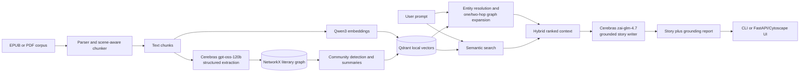

# Homer

*Homer* is a corpus-grounded literary storyteller. It indexes EPUB/PDF text as
both semantic passages and a literary knowledge graph, then retrieves the canon
needed to write a continuation, counterfactual, or answer to a story prompt.

The current prototype is built around two Sherlock Holmes EPUBs. It keeps the
graph and Qdrant index local, while using Cerebras for structured extraction,
community summaries, and story generation.

Demo Video https://www.loom.com/share/f9e9466eaebf41fc96317a7f026ff6b2

## Repository Overview

```text
homer/
├── README.md                  : Project guide, commands, architecture, and tests
├── pyproject.toml             : Python package metadata, dependencies, and CLI entry points
├── .python-version            : Local pyenv environment selector (`nli`)
├── data/
│   └── *.epub                 : Local literary inputs (ignored by Git)
├── src/homer/
│   ├── cli.py                 : `homer ingest`, `inspect`, `retrieve`, and `write`
│   ├── web.py                 : FastAPI application and graph/chat API routes
│   ├── static/
│   │   ├── index.html         : Lightweight graph and storyteller UI
│   │   ├── app.js             : Cytoscape rendering and chat interactions
│   │   └── styles.css         : Responsive UI styling
│   ├── parsers.py             : EPUB/PDF metadata and text extraction
│   ├── chunking.py            : Chapter- and scene-aware text chunking
│   ├── embeddings.py          : Qwen3 embedding provider
│   ├── graph.py               : NetworkX entities, relationships, and communities
│   ├── pipeline.py            : Ingestion, indexing, retrieval, and writing orchestration
│   ├── storage.py             : JSON corpus state and embedded Qdrant persistence
│   ├── llm.py                 : Cerebras extraction, summarization, and writing providers
│   └── models.py              : Pydantic schemas exchanged across the pipeline
├── tests/
│   ├── test_parsers.py        : Real EPUB parsing and provenance tests
│   ├── test_pipeline.py       : Offline ingestion, retrieval, caching, and writing tests
│   ├── test_graph.py          : Alias resolution and community tests
│   ├── test_web.py            : Graph API payload and focused evidence graph tests
│   ├── test_embeddings_integration.py : Real Qwen embedding integration test
│   └── test_live_cerebras.py  : Opt-in live Cerebras end-to-end tests
├── .homer/                    : Generated graph, vectors, caches, and checkpoints (ignored)
└── .env                       : Local secrets such as `CEREBRAS_API_KEY` (ignored)
```

## Getting Started

*Homer* uses a python environment and requires Python 3.11 or
3.12.

```bash
cd homer
python -m pip install -e ".[dev]"
```

Create `.env` in the repository root and add the Cerebras key:

```text
CEREBRAS_API_KEY=your_key_here
```

Build the Sherlock corpus from the two local EPUBs:

```bash
homer ingest \
  data/pg1661-images-3.epub \
  data/pg2097-images-3.epub \
  --corpus sherlock
```

Ingestion is resumable. Extracted graph batches, community summaries, and
completed chunks are cached under `.homer/sherlock/` so re-running the command
does not repeat finished work.

## Putting Homer to Work

Inspect the indexed corpus:

```bash
homer inspect --corpus sherlock
```

Retrieve the relevant canon without generating a story:

```bash
homer retrieve \
  --corpus sherlock \
  --prompt "Write a follow-up to The Adventure of the Blue Carbuncle"
```

Generate a grounded continuation as JSON, including its grounding report:

```bash
homer write \
  --corpus sherlock \
  --max-words 1200 \
  --prompt "What would have happened if Sherlock Holmes had caught Irene Adler?" \
  --output story.json
```

Launch the web UI:

```bash
homer-web
```

Open <http://127.0.0.1:8000>. The initial view shows the complete knowledge
graph. Hover nodes or relationships for evidence. After a prompt completes,
the graph switches to only the nodes, relationships, and communities supplied
to the writer.

## How does *Homer* work?

### Architecture



### Why a graph helps retrieval

Vector search is useful for finding passages that resemble a prompt, but a
literary continuation also needs relationships, entities, and narrative
structure. *Homer* combines both representations:

- The graph connects characters, aliases, places, objects, events, traits, and
  actions. A prompt about Irene Adler can therefore retrieve her relationships
  with Sherlock even when the wording differs from the query.
- One- and two-hop expansion supplies local lore and preserves relationship
  evidence instead of returning isolated text fragments.
- Community summaries provide a compact view of larger subplots and story
  clusters.
- Qdrant still retrieves stylistically and semantically similar passages, so
  the writer receives useful prose context as well as a structured canon.
- The final grounding report makes the context auditable: users can see which
  chapters, chunks, graph facts, and communities influenced the output.

### Technology stack

| Layer | Technology | Role |
| --- | --- | --- |
| Document parsing | EbookLib, BeautifulSoup, PyMuPDF | Read EPUB/PDF metadata, chapters, and clean text |
| Embeddings | `Qwen/Qwen3-Embedding-0.6B` via Sentence Transformers | Normalized 1024-dimensional vectors for chunks, entities, and summaries |
| Vector retrieval | Qdrant client in local mode | Persistent semantic search without a hosted vector database |
| Knowledge graph | NetworkX | Entity, alias, relationship, evidence, and community representation |
| Graph extraction | Cerebras `gpt-oss-120b` | Structured entities, traits, events, and relationships |
| Community summaries | Cerebras structured generation | Compact summaries of major graph clusters |
| Story generation | Cerebras `zai-glm-4.7` | Canon-grounded continuation and counterfactual writing |
| Orchestration | Python, Pydantic, Typer | Typed pipeline models and command-line workflows |
| Web application | FastAPI, Uvicorn, Cytoscape.js | Lightweight API and interactive graph/story interface |

## Tests

Run the deterministic suite:

```bash
pytest -m "not integration and not live"
```

Run the real Qwen embedding integration test:

```bash
pytest -m integration
```

Run live Cerebras tests only when `CEREBRAS_API_KEY` is configured:

```bash
pytest -m live
```
